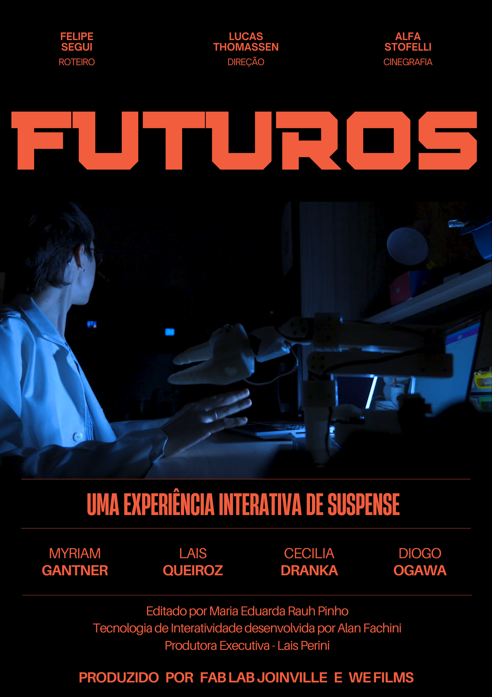

# Filme Futuros

Esse é o site de votação do filme interativo Futuros.
Ele foi feito através da técnica de Vibe Coding usando o editor Cursor e a ferramenta de voz superwhisper.

## Prompts

Cada commit é o resultado de um prompt. Os prompts usados estão na descrição dos commits.
Quando o commit não conter "Promp", significa que ele foi feito por um humano.

## Poster

